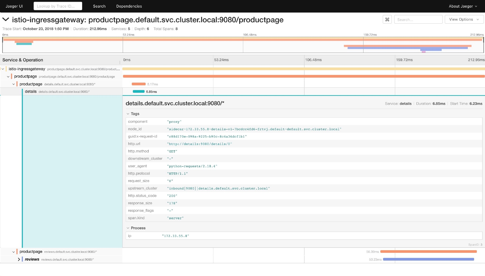
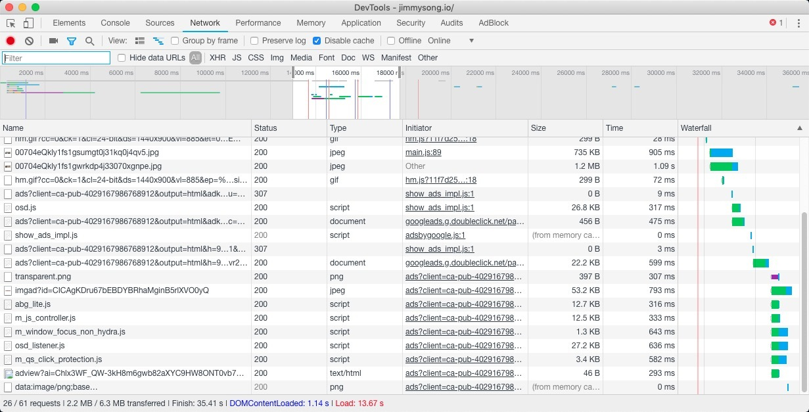

# OpenTracing

[OpenTracing](https://opentracing.io/) 是 CNCF 提出的分布式追踪的标准，它提供用厂商中立的 API，并提供 Go、Java、JavaScript、Python、Ruby、PHP、Objective-C、C++ 和 C# 这九种语言的库。

目前支持 Tracer 包括 Zipkin、Skywalking、Jaeger 等，支持的框架包括 gRPC、MOTAN、django、Flask、Sharding-JDBC 等，详见 [OpenTracing 官网](https://opentracing.io/)。

Jaeger 是遵循 OpenTracing 的一种实现。



关于 OpenTracing 的详细约定请参考：

- [OpenTracing 语义规范（Semantic Specification）](https://github.com/opentracing/specification/blob/master/specification.md)
- [OpenTracing 语义约定（Semantic Conventions）](https://github.com/opentracing/specification/blob/master/semantic_conventions.md)

## 基本术语

如下是 OpenTracing 中定义的基本术语。

**Trace**

Trace 通常指一次完整的调用链。如上文中的 Jaeger UI 截图就是 Istio 官方提供的 [Bookinfo 示例](https://istio.io/zh/docs/examples/bookinfo/) 的追踪中对 `productpage` 的调用链分析。

**Span**

每个 trace 都由一系列 Span 组成，一个 span 可以理解为两个微服务之间的调用，如同 Chrome 检查器中查看网络访问瀑布一样。



根据 OpenTracing 的规格约定，每个 Span 都要包含以下状态：

- **操作名称**：可以是访问的一个 URL。必填。例如 `localhost:8808/`。
- **起/止时间戳**：也可以使用起始时间和持续时间来表示。必填。例如 `1540273832696773`。
- **Tags**：一组键值对集合，[Semantic Conventions](https://github.com/opentracing/specification/blob/master/semantic_conventions.md) 有一些常用约定。必填。例如 `http.protocol`。
- **Logs**：一组键值对集合，用于记录调用日志。可选填。
- **SpanContext**：在进程间通信时携带的 span 信息，指整个 trace。

**示例**

下面是 Jaeger 收集的来自 [Bookinfo 示例](https://istio.io/zh/docs/examples/bookinfo/) 中的 `productpage` 的调用链追踪数据。

```json
{
    "data": [
        {
            "traceID": "aaccbe962478cf93",
            "spans": [
                {
                    "traceID": "aaccbe962478cf93",
                    "spanID": "fa36a9cbd60b4ae5",
                    "operationName": "details.default.svc.cluster.local:9080/*",
                    "references": [
                        {
                            "refType": "CHILD_OF",
                            "traceID": "aaccbe962478cf93",
                            "spanID": "2"
                        }
                    ],
                    "startTime": 1540273832696773,
                    "duration": 8171,
                    "tags": [
                        {
                            "key": "component",
                            "type": "string",
                            "value": "proxy"
                        },
                        {
                            "key": "node_id",
                            "type": "string",
                            "value": "sidecar~172.33.5.11~productpage-v1-8584c875d8-4jgwg.default~default.svc.cluster.local"
                        }
                        ...
                    ],
                    "logs": [],
                    "processID": "p1",
                    "warnings": null
                },
                ...
            ],
            "processes": {
                "p1": {
                    "serviceName": "productpage",
                    "tags": [
                        {
                            "key": "ip",
                            "type": "string",
                            "value": "172.33.5.11"
                        }
                    ]
                },
                ...
            },
            "warnings": null
        }
    ],
    "total": 0,
    "limit": 0,
    "offset": 0,
    "errors": null
}
```

在开发应用时需要使用兼容 OpenTracing API 的 Tracing 实现库，例如 [Jaeger](https://www.jaegertracing.io) 来实现自动的分布式追踪。

## 参考

- [OpenTracing 官方网站](https://opentracing.io/)
- [OpenTracing 语义规范（Semantic Specification）](https://github.com/opentracing/specification/blob/master/specification.md)
- [OpenTracing 语义约定（Semantic Conventions）](https://github.com/opentracing/specification/blob/master/semantic_conventions.md)
- [开放分布式追踪（OpenTracing）入门与 Jaeger 实现](https://yq.aliyun.com/articles/514488#19)
