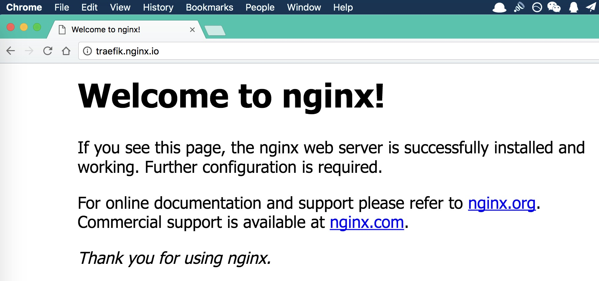
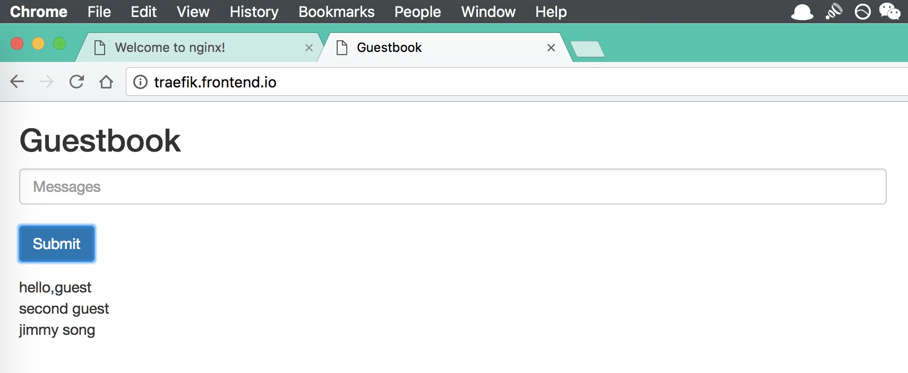

# 安装traefik ingress

## Ingress简介

如果你还不了解，ingress是什么，可以先看下我翻译的Kubernetes官网上ingress的介绍[Kubernetes Ingress解析](http://rootsongjc.github.io/blogs/kubernetes-ingress-resource/)。

**理解Ingress**

简单的说，ingress就是从kubernetes集群外访问集群的入口，将用户的URL请求转发到不同的service上。Ingress相当于nginx、apache等负载均衡方向代理服务器，其中还包括规则定义，即URL的路由信息，路由信息得的刷新由[Ingress controller](https://kubernetes.io/docs/concepts/services-networking/ingress/#ingress-controllers)来提供。

**理解Ingress Controller**

Ingress Controller 实质上可以理解为是个监视器，Ingress Controller 通过不断地跟 kubernetes API 打交道，实时的感知后端 service、pod 等变化，比如新增和减少 pod，service 增加与减少等；当得到这些变化信息后，Ingress Controller 再结合下文的 Ingress 生成配置，然后更新反向代理负载均衡器，并刷新其配置，达到服务发现的作用。

## 部署Traefik

**介绍traefik**

[Traefik](https://traefik.io/)是一款开源的反向代理与负载均衡工具。它最大的优点是能够与常见的微服务系统直接整合，可以实现自动化动态配置。目前支持Docker, Swarm, Mesos/Marathon, Mesos, Kubernetes, Consul, Etcd, Zookeeper, BoltDB, Rest API等等后端模型。

以下配置文件可以在[kubernetes-handbook](https://github.com/rootsongjc/kubernetes-handbook)GitHub仓库中的[../manifests/traefik-ingress/](https://github.com/rootsongjc/kubernetes-handbook/blob/master/manifests/traefik-ingress/)目录下找到。

**创建ingress-rbac.yaml**

将用于service account验证。

```Yaml
apiVersion: v1
kind: ServiceAccount
metadata:
  name: ingress
  namespace: kube-system

---

kind: ClusterRoleBinding
apiVersion: rbac.authorization.k8s.io/v1beta1
metadata:
  name: ingress
subjects:
  - kind: ServiceAccount
    name: ingress
    namespace: kube-system
roleRef:
  kind: ClusterRole
  name: cluster-admin
  apiGroup: rbac.authorization.k8s.io
```

**创建名为`traefik-ingress`的ingress**，文件名traefik.yaml

```yaml
apiVersion: extensions/v1beta1
kind: Ingress
metadata:
  name: traefik-ingress
  namespace: default
spec:
  rules:
  - host: traefik.nginx.io
    http:
      paths:
      - path: /
        backend:
          serviceName: my-nginx
          servicePort: 80
  - host: traefik.frontend.io
    http:
      paths:
      - path: /
        backend:
          serviceName: frontend
          servicePort: 80
```

这其中的`backend`中要配置default namespace中启动的service名字，如果你没有配置namespace名字，默认使用default namespace，如果你在其他namespace中创建服务想要暴露到kubernetes集群外部，可以创建新的ingress.yaml文件，同时在文件中指定该`namespace`，其他配置与上面的文件格式相同。。`path`就是URL地址后的路径，如traefik.frontend.io/path，service将会接受path这个路径，host最好使用service-name.filed1.filed2.domain-name这种类似主机名称的命名方式，方便区分服务。

根据你自己环境中部署的service的名字和端口自行修改，有新service增加时，修改该文件后可以使用`kubectl replace -f traefik.yaml`来更新。

我们现在集群中已经有两个service了，一个是nginx，另一个是官方的`guestbook`例子。

**创建DaemonSet**

我们使用DaemonSet类型来部署Traefik，并使用`nodeSelector`来限定Traefik所部署的主机。

```Yaml
apiVersion: extensions/v1beta1
kind: DaemonSet
metadata:
  name: traefik-ingress-lb
  namespace: kube-system
  labels:
    k8s-app: traefik-ingress-lb
spec:
  template:
    metadata:
      labels:
        k8s-app: traefik-ingress-lb
        name: traefik-ingress-lb
    spec:
      terminationGracePeriodSeconds: 60
      hostNetwork: true
      restartPolicy: Always
      serviceAccountName: ingress
      containers:
      - image: traefik
        name: traefik-ingress-lb
        resources:
          limits:
            cpu: 200m
            memory: 30Mi
          requests:
            cpu: 100m
            memory: 20Mi
        ports:
        - name: http
          containerPort: 80
          hostPort: 80
        - name: admin
          containerPort: 8580
          hostPort: 8580
        args:
        - --web
        - --web.address=:8580
        - --kubernetes
      nodeSelector:
        edgenode: "true"
```

**注意**：我们使用了`nodeSelector`选择边缘节点来调度traefik-ingress-lb运行在它上面，所有你需要使用：

```ini
kubectl label nodes 172.20.0.113 edgenode=true
kubectl label nodes 172.20.0.114 edgenode=true
kubectl label nodes 172.20.0.115 edgenode=true
```

给三个node打标签，这样traefik的pod才会调度到这几台主机上，否则会一直处于`pending`状态。

关于使用Traefik作为边缘节点请参考[边缘节点配置](../practice/edge-node-configuration.md)。

**Traefik UI**

使用下面的YAML配置来创建Traefik的Web UI。

```yaml
apiVersion: v1
kind: Service
metadata:
  name: traefik-web-ui
  namespace: kube-system
spec:
  selector:
    k8s-app: traefik-ingress-lb
  ports:
  - name: web
    port: 80
    targetPort: 8580
---
apiVersion: extensions/v1beta1
kind: Ingress
metadata:
  name: traefik-web-ui
  namespace: kube-system
spec:
  rules:
  - host: traefik-ui.local
    http:
      paths:
      - path: /
        backend:
          serviceName: traefik-web-ui
          servicePort: web
```

配置完成后就可以启动treafik ingress了。

```
kubectl create -f .
```

我查看到traefik的pod在`172.20.0.115`这台节点上启动了。

访问该地址`http://172.20.0.115:8580/`将可以看到dashboard。


左侧黄色部分部分列出的是所有的rule，右侧绿色部分是所有的backend。

## 测试

在集群的任意一个节点上执行。假如现在我要访问nginx的"/"路径。

```bash
$ curl -H Host:traefik.nginx.io http://172.20.0.115/
<!DOCTYPE html>
<html>
<head>
<title>Welcome to nginx!</title>
<style>
    body {
        width: 35em;
        margin: 0 auto;
        font-family: Tahoma, Verdana, Arial, sans-serif;
    }
</style>
</head>
<body>
<h1>Welcome to nginx!</h1>
<p>If you see this page, the nginx web server is successfully installed and
working. Further configuration is required.</p>

<p>For online documentation and support please refer to
<a href="http://nginx.org/">nginx.org</a>.<br/>
Commercial support is available at
<a href="http://nginx.com/">nginx.com</a>.</p>

<p><em>Thank you for using nginx.</em></p>
</body>
</html>
```

如果你需要在kubernetes集群以外访问就需要设置DNS，或者修改本机的hosts文件。

在其中加入：

```
172.20.0.115 traefik.nginx.io
172.20.0.115 traefik.frontend.io
```

所有访问这些地址的流量都会发送给172.20.0.115这台主机，就是我们启动traefik的主机。

Traefik会解析http请求header里的Host参数将流量转发给Ingress配置里的相应service。

修改hosts后就就可以在kubernetes集群外访问以上两个service，如下图：







## 参考

[Traefik-kubernetes 初试](http://www.colabug.com/thread-1703745-1-1.html)

[Traefik简介](http://www.tuicool.com/articles/ZnuEfay)

[Guestbook example](https://github.com/kubernetes/kubernetes/tree/master/examples/guestbook)