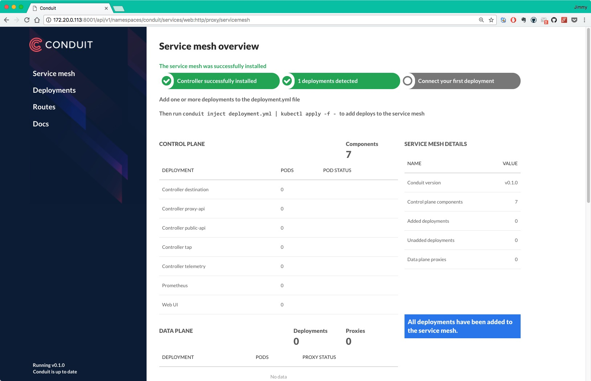

# 安装Conduit

本文档指导您如何在kubernetes上安装Conduit service mesh。

## 前提条件

- kubernetes版本为1.8或以上

用到的镜像如下：

- buoyantio/kubectl:v1.6.2
- gcr.io/runconduit/controller:v0.1.0
- gcr.io/runconduit/web:v0.1.0
- prom/prometheus:v1.8.1

其中位于gcr.io的镜像我备份到了DockerHub：

- jimmysong/runconduit-web:v0.1.0
- jimmysong/runconduit-controller:v0.1.0

另外两个镜像本身就可以从DockerHub上下载。

## 部署

到[release页面](https://github.com/runconduit/conduit/releases)上下载conduit的二进制文件。

使用`conduit install`命令生成了用于部署到kubernetes中yaml文件，然后修改文件中的镜像仓库地址为你自己的镜像地址。

```bash
conduit install>conduit-0.1.0.yaml
# 修改完镜像地址执行
kubectl apply -f conduit-0.1.0.yaml
```

修改后的yaml文件见：[conduit-0.1.0.yaml](https://github.com/rootsongjc/kubernetes-handbook/tree/master/manifests/conduit-0.1.0.yaml)。

使用`kubectl proxy`来开放外网访问conduit dashboard：

```bash
kubectl proxy --address='172.20.0.113' --port=8001 --accept-hosts='^*$'
```

在浏览器中访问<http://172.20.0.113:8001/api/v1/namespaces/conduit/services/web:http/proxy/servicemesh>将看到如下页面：

