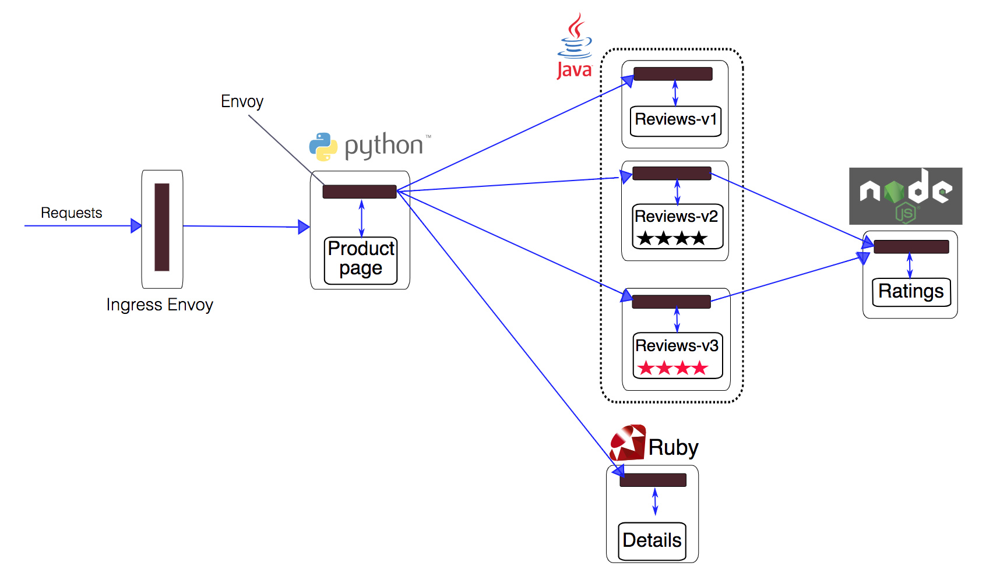
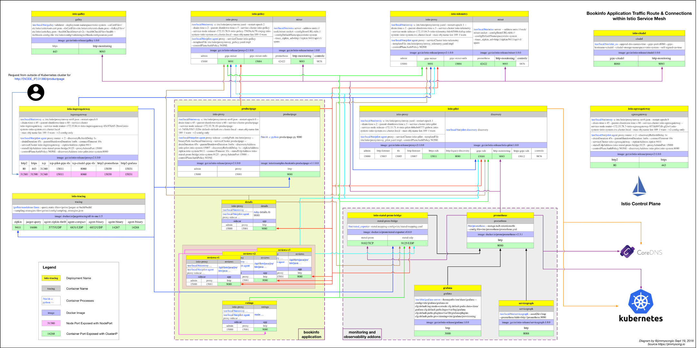
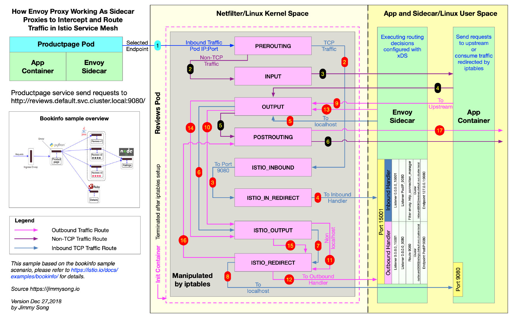

# 深入理解Istio Service Mesh中的Envoy Sidecar代理的路由转发

**注意：本书中的 Service Mesh 章节已不再维护，请转到 [istio-handbook](https://www.servicemesher.com/istio-handbook) 中浏览。**

本文以 Istio 官方的 [bookinfo 示例](https://preliminary.istio.io/zh/docs/examples/bookinfo)来讲解在进入 Pod 的流量被 iptables 转交给 Envoy sidecar 后，Envoy 是如何做路由转发的，详述了 Inbound 和 Outbound 处理过程。关于流量拦截的详细分析请参考[理解 Istio Service Mesh 中 Envoy 代理 Sidecar 注入及流量劫持](https://jimmysong.io/posts/envoy-sidecar-injection-in-istio-service-mesh-deep-dive/)。

下面是 Istio 官方提供的 bookinfo 的请求流程图，假设 bookinfo 应用的所有服务中没有配置 DestinationRule。



下面是 Istio 自身组件与 Bookinfo 示例的连接关系图，我们可以看到所有的 HTTP 连接都在 9080 端口监听。



可以在 [Google Drive](https://drive.google.com/open?id=19ed3_tkjf6RgGboxllMdt_Ytd5_cocib) 上下载原图。

## Sidecar 注入及流量劫持步骤概述

下面是从 Sidecar 注入、Pod 启动到 Sidecar proxy 拦截流量及 Envoy 处理路由的步骤概览。

**1.** Kubernetes 通过 Admission Controller 自动注入，或者用户使用 `istioctl` 命令手动注入 sidecar 容器。

**2.** 应用 YAML 配置部署应用，此时 Kubernetes API server 接收到的服务创建配置文件中已经包含了 Init 容器及 sidecar proxy。

**3.** 在 sidecar proxy 容器和应用容器启动之前，首先运行 Init 容器，Init 容器用于设置 iptables（Istio 中默认的流量拦截方式，还可以使用 BPF、IPVS 等方式） 将进入 pod 的流量劫持到 Envoy sidecar proxy。所有 TCP 流量（Envoy 目前只支持 TCP 流量）将被 sidecar 劫持，其他协议的流量将按原来的目的地请求。

**4.** 启动 Pod 中的 Envoy sidecar proxy 和应用程序容器。这一步的过程请参考[通过管理接口获取完整配置](https://zhaohuabing.com/post/2018-09-25-istio-traffic-management-impl-intro/#%E9%80%9A%E8%BF%87%E7%AE%A1%E7%90%86%E6%8E%A5%E5%8F%A3%E8%8E%B7%E5%8F%96%E5%AE%8C%E6%95%B4%E9%85%8D%E7%BD%AE)。

> **Sidecar proxy 与应用容器的启动顺序问题**
>
> 启动 sidecar proxy 和应用容器，究竟哪个容器先启动呢？正常情况是 Envoy Sidecar 和应用程序容器全部启动完成后再开始接收流量请求。但是我们无法预料哪个容器会先启动，那么容器启动顺序是否会对 Envoy 劫持流量有影响呢？答案是肯定的，不过分为以下两种情况。
>
> **情况1：应用容器先启动，而 sidecar proxy 仍未就绪**
>
> 这种情况下，流量被 iptables 转移到 15001 端口，而 Pod 中没有监听该端口，TCP 链接就无法建立，请求失败。
>
> **情况2：Sidecar 先启动，请求到达而应用程序仍未就绪**
>
> 这种情况下请求也肯定会失败，至于是在哪一步开始失败的，留给读者来思考。

**问题**：如果为 sidecar proxy 和应用程序容器添加[就绪和存活探针](https://jimmysong.io/kubernetes-handbook/guide/configure-liveness-readiness-probes.html)是否可以解决该问题呢？

**5.** 不论是进入还是从 Pod 发出的 TCP 请求都会被 iptables 劫持，inbound 流量被劫持后经 Inbound Handler 处理后转交给应用程序容器处理，outbound 流量被 iptables 劫持后转交给 Outbound Handler 处理，并确定转发的 upstream 和 Endpoint。

**6.** Sidecar proxy 请求 Pilot 使用 xDS 协议同步 Envoy 配置，其中包括 LDS、EDS、CDS 等，不过为了保证更新的顺序，Envoy 会直接使用 ADS 向 Pilot 请求配置更新。

## Envoy 如何处理路由转发

 下图展示的是 `productpage` 服务请求访问 `http://reviews.default.svc.cluster.local:9080/`，当流量进入 `reviews` 服务内部时，`reviews` 服务内部的 Envoy Sidecar 是如何做流量拦截和路由转发的。可以在 [Google Drive](https://drive.google.com/file/d/1n-h235tm8DnL_RqxTTA95rgGtrLkBsyr/view?usp=sharing) 上下载原图。



第一步开始时，`productpage` Pod 中的 Envoy sidecar 已经通过 EDS 选择出了要请求的 `reviews` 服务的一个 Pod，知晓了其 IP 地址，发送 TCP 连接请求。

Istio 官网中的 Envoy 配置深度解析中是以发起 HTTP 请求的一方来详述 Envoy 做流量转发的过程，而本文中考虑的是接受 downstream 的流量的一方，它既要接收 downstream 发来的请求，自己还需要请求其他服务，例如 `reviews` 服务中的 Pod 还需要请求 `ratings` 服务。

`reviews` 服务有三个版本，每个版本有一个实例，三个版本中的 sidecar 工作步骤类似，下文只以 `reviews-v1-cb8655c75-b97zc` 这一个 Pod 中的 Sidecar 流量转发步骤来说明。

## 理解 Inbound Handler

Inbound handler 的作用是将 iptables 拦截到的 downstream 的流量转交给 localhost，与 Pod 内的应用程序容器建立连接。

查看下 `reviews-v1-cb8655c75-b97zc` pod 中的 Listener。

运行 `istioctl pc listener reviews-v1-cb8655c75-b97zc` 查看该 Pod 中的具有哪些 Listener。

```ini
ADDRESS            PORT      TYPE 
172.33.3.3         9080      HTTP <--- 接收所有 Inbound HTTP 流量，该地址即为当前 Pod 的 IP 地址
10.254.0.1         443       TCP  <--+
10.254.4.253       80        TCP     |
10.254.4.253       8080      TCP     |
10.254.109.182     443       TCP     |
10.254.22.50       15011     TCP     |
10.254.22.50       853       TCP     |
10.254.79.114      443       TCP     | 
10.254.143.179     15011     TCP     |
10.254.0.2         53        TCP     | 接收与 0.0.0.0_15001 监听器配对的 Outbound 非 HTTP 流量
10.254.22.50       443       TCP     |
10.254.16.64       42422     TCP     |
10.254.127.202     16686     TCP     |
10.254.22.50       31400     TCP     |
10.254.22.50       8060      TCP     |
10.254.169.13      14267     TCP     |
10.254.169.13      14268     TCP     |
10.254.32.134      8443      TCP     |
10.254.118.196     443       TCP  <--+
0.0.0.0            15004     HTTP <--+
0.0.0.0            8080      HTTP    |
0.0.0.0            15010     HTTP    | 
0.0.0.0            8088      HTTP    |
0.0.0.0            15031     HTTP    |
0.0.0.0            9090      HTTP    | 
0.0.0.0            9411      HTTP    | 接收与 0.0.0.0_15001 配对的 Outbound HTTP 流量
0.0.0.0            80        HTTP    |
0.0.0.0            15030     HTTP    |
0.0.0.0            9080      HTTP    |
0.0.0.0            9093      HTTP    |
0.0.0.0            3000      HTTP    |
0.0.0.0            8060      HTTP    |
0.0.0.0            9091      HTTP <--+    
0.0.0.0            15001     TCP  <--- 接收所有经 iptables 拦截的 Inbound 和 Outbound 流量并转交给虚拟监听器处理
```

当来自 `productpage` 的流量抵达 `reviews` Pod 的时候已经，downstream 必须明确知道 Pod 的 IP 地址为 `172.33.3.3` 所以才会访问该 Pod，所以该请求是 `172.33.3.3:9080`。

**`virtual` Listener**

从该 Pod 的 Listener 列表中可以看到，0.0.0.0:15001/TCP 的 Listener（其实际名字是 `virtual`）监听所有的 Inbound 流量，下面是该 Listener 的详细配置。

```json
{
    "name": "virtual",
    "address": {
        "socketAddress": {
            "address": "0.0.0.0",
            "portValue": 15001
        }
    },
    "filterChains": [
        {
            "filters": [
                {
                    "name": "envoy.tcp_proxy",
                    "config": {
                        "cluster": "BlackHoleCluster",
                        "stat_prefix": "BlackHoleCluster"
                    }
                }
            ]
        }
    ],
    "useOriginalDst": true
}
```

**UseOriginalDst**：从配置中可以看出 `useOriginalDst` 配置指定为 `true`，这是一个布尔值，缺省为 false，使用 iptables 重定向连接时，proxy 接收的端口可能与[原始目的地址](http://www.servicemesher.com/envoy/configuration/listener_filters/original_dst_filter.html)的端口不一样，如此处 proxy 接收的端口为 15001，而原始目的地端口为 9080。当此标志设置为 true 时，Listener 将连接重定向到与原始目的地址关联的 Listener，此处为 `172.33.3.3:9080`。如果没有与原始目的地址关联的 Listener，则连接由接收它的 Listener 处理，即该 `virtual` Listener，经过 `envoy.tcp_proxy` 过滤器处理转发给 `BlackHoleCluster`，这个 Cluster 的作用正如它的名字，当 Envoy 找不到匹配的虚拟监听器时，就会将请求发送给它，并返回 404。这个将于下文提到的 Listener 中设置 `bindToPort` 相呼应。

**注意**：该参数将被废弃，请使用[原始目的地址](http://www.servicemesher.com/envoy/configuration/listener_filters/original_dst_filter.html)的 Listener filter 替代。该参数的主要用途是：Envoy 通过监听 15001 端口将 iptables 拦截的流量经由其他 Listener 处理而不是直接转发出去，详情见 [Virtual Listener](https://zhaohuabing.com/post/2018-09-25-istio-traffic-management-impl-intro/#virtual-listener)。

**Listener 172.33.3.3_9080**

上文说到进入 Inbound handler 的流量被 `virtual` Listener 转移到 `172.33.3.3_9080` Listener，我们在查看下该 Listener 配置。

运行 `istioctl pc listener reviews-v1-cb8655c75-b97zc --address 172.33.3.3 --port 9080 -o json` 查看。

```json
[{
    "name": "172.33.3.3_9080",
    "address": {
        "socketAddress": {
            "address": "172.33.3.3",
            "portValue": 9080
        }
    },
    "filterChains": [
        {
            "filterChainMatch": {
                "transportProtocol": "raw_buffer"
            },
            "filters": [
                {
                    "name": "envoy.http_connection_manager",
                    "config": {
                        ... 
                        "route_config": {
                            "name": "inbound|9080||reviews.default.svc.cluster.local",
                            "validate_clusters": false,
                            "virtual_hosts": [
                                {
                                    "domains": [
                                        "*"
                                    ],
                                    "name": "inbound|http|9080",
                                    "routes": [
                                        {
                                            ...
                                            "route": {
                                                "cluster": "inbound|9080||reviews.default.svc.cluster.local",
                                                "max_grpc_timeout": "0.000s",
                                                "timeout": "0.000s"
                                            }
                                        }
                                    ]
                                }
                            ]
                        },
                        "use_remote_address": false,
                        ...
                    }
                }
            ]，
            "deprecatedV1": {
                "bindToPort": false
            }
        ...
        },
        {
            "filterChainMatch": {
                "transportProtocol": "tls"
            },
            "tlsContext": {...
            },
            "filters": [...
            ]
        }
    ],
...
}]
```

**bindToPort**：注意其中有一个 [`bindToPort`](https://www.envoyproxy.io/docs/envoy/v1.6.0/api-v1/listeners/listeners) 的配置，其值为 `false`，该配置的缺省值为 `true`，表示将 Listener 绑定到端口上，此处设置为 `false` 则该 Listener 只能处理其他 Listener 转移过来的流量，即上文所说的 `virtual` Listener，我们看其中的 filterChains.filters 中的 `envoy.http_connection_manager` 配置部分：

```json
"route_config": {
                            "name": "inbound|9080||reviews.default.svc.cluster.local",
                            "validate_clusters": false,
                            "virtual_hosts": [
                                {
                                    "domains": [
                                        "*"
                                    ],
                                    "name": "inbound|http|9080",
                                    "routes": [
                                        {
                                            ...
                                            "route": {
                                                "cluster": "inbound|9080||reviews.default.svc.cluster.local",
                                                "max_grpc_timeout": "0.000s",
                                                "timeout": "0.000s"
                                            }
                                        }
                                    ]
                                }
                            ]
                        }
```

该配置表示流量将转交给 Cluster `inbound|9080||reviews.default.svc.cluster.local` 处理。

**Cluster `inbound|9080||reviews.default.svc.cluster.local`**

运行 `istioctl pc cluster reviews-v1-cb8655c75-b97zc --fqdn reviews.default.svc.cluster.local --direction inbound -o json` 查看该 Cluster 的配置如下。

```json
[
    {
        "name": "inbound|9080||reviews.default.svc.cluster.local",
        "connectTimeout": "1.000s",
        "hosts": [
            {
                "socketAddress": {
                    "address": "127.0.0.1",
                    "portValue": 9080
                }
            }
        ],
        "circuitBreakers": {
            "thresholds": [
                {}
            ]
        }
    }
]
```

可以看到该 Cluster 的 Endpoint 直接对应的就是 localhost，再经过 iptables 转发流量就被应用程序容器消费了。

## 理解 Outbound Handler

因为 `reviews` 会向 `ratings` 服务发送 HTTP 请求，请求的地址是：`http://ratings.default.svc.cluster.local:9080/`，Outbound handler 的作用是将 iptables 拦截到的本地应用程序发出的流量，经由 Envoy 判断如何路由到 upstream。

应用程序容器发出的请求为 Outbound 流量，被 iptables 劫持后转移给 Envoy  Outbound handler 处理，然后经过 `virtual` Listener、`0.0.0.0_9080` Listener，然后通过 Route 9080 找到 upstream 的 cluster，进而通过 EDS 找到 Endpoint 执行路由动作。

**Route 9080**

`reviews` 会请求 `ratings` 服务，运行 `istioctl proxy-config routes reviews-v1-cb8655c75-b97zc --name 9080 -o json` 查看 route 配置，因为 Envoy 会根据 HTTP header 中的 domains 来匹配 VirtualHost，所以下面只列举了 `ratings.default.svc.cluster.local:9080` 这一个 VirtualHost。

```json
[{
    "name": "ratings.default.svc.cluster.local:9080",
    "domains": [
        "ratings.default.svc.cluster.local",
        "ratings.default.svc.cluster.local:9080",
        "ratings",
        "ratings:9080",
        "ratings.default.svc.cluster",
        "ratings.default.svc.cluster:9080",
        "ratings.default.svc",
        "ratings.default.svc:9080",
        "ratings.default",
        "ratings.default:9080",
        "10.254.234.130",
        "10.254.234.130:9080"
    ],
    "routes": [
        {
            "match": {
                "prefix": "/"
            },
            "route": {
                "cluster": "outbound|9080||ratings.default.svc.cluster.local",
                "timeout": "0.000s",
                "maxGrpcTimeout": "0.000s"
            },
            "decorator": {
                "operation": "ratings.default.svc.cluster.local:9080/*"
            },
            "perFilterConfig": {...
            }
        }
    ]
},
..]
```

从该 Virtual Host 配置中可以看到将流量路由到 Cluster `outbound|9080||ratings.default.svc.cluster.local`。

**Endpoint `outbound|9080||ratings.default.svc.cluster.local`**

Istio 1.1 以前版本不支持使用 `istioctl` 命令直接查询 Cluster 的 Endpoint，可以使用查询 Pilot 的 debug 端点的方式折中。

```bash
kubectl exec reviews-v1-cb8655c75-b97zc -c istio-proxy curl http://istio-pilot.istio-system.svc.cluster.local:9093/debug/edsz > endpoints.json
```

`endpoints.json` 文件中包含了所有 Cluster 的 Endpoint 信息，我们只选取其中的 `outbound|9080||ratings.default.svc.cluster.local` Cluster 的结果如下。

```json
{
  "clusterName": "outbound|9080||ratings.default.svc.cluster.local",
  "endpoints": [
    {
      "locality": {

      },
      "lbEndpoints": [
        {
          "endpoint": {
            "address": {
              "socketAddress": {
                "address": "172.33.100.2",
                "portValue": 9080
              }
            }
          },
          "metadata": {
            "filterMetadata": {
              "istio": {
                  "uid": "kubernetes://ratings-v1-8558d4458d-ns6lk.default"
                }
            }
          }
        }
      ]
    }
  ]
}
```

Endpoint 可以是一个或多个，Envoy 将根据一定规则选择适当的 Endpoint 来路由。

**注**：Istio 1.1 将支持 `istioctl pc endpoint` 命令来查询 Endpoint。

## 参考

- [调试 Envoy 和 Pilot - istio.io](https://preliminary.istio.io/zh/help/ops/traffic-management/proxy-cmd/)
- [理解 Istio Service Mesh 中 Envoy 代理 Sidecar 注入及流量劫持 - jimmysong.io](https://jimmysong.io/posts/envoy-sidecar-injection-in-istio-service-mesh-deep-dive/)
- [Istio流量管理实现机制深度解析 - zhaohuabing.com](https://zhaohuabing.com/post/2018-09-25-istio-traffic-management-impl-intro/)

